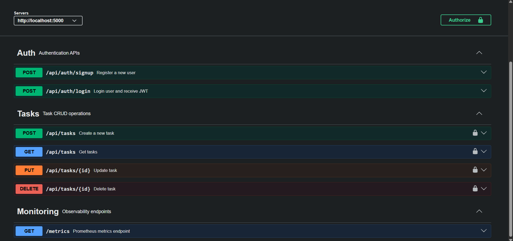
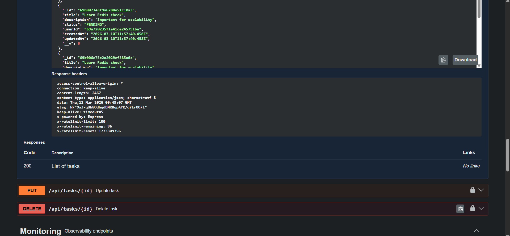
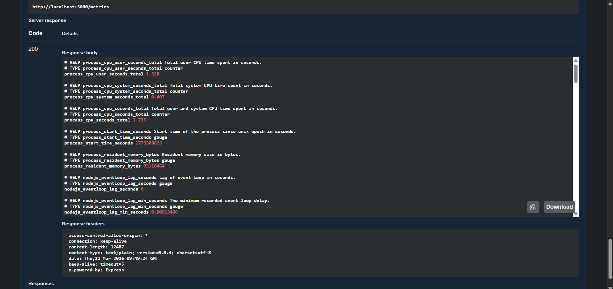

# 🚀 OPS Track API
### Scalable Role-Based Task & Workflow Management Backend

A **production-ready backend system** built with **Node.js, TypeScript, MongoDB, Redis, and BullMQ**, designed to demonstrate **scalable backend architecture, observability, and performance optimization**.

This project includes **authentication, role-based access control, caching, background jobs, rate limiting, and monitoring dashboards**.

## Live API

Base URL  
https://opstrack-api.onrender.com

API Documentation  
https://opstrack-api.onrender.com/api-docs

Metrics Endpoint  
https://opstrack-api.onrender.com/metrics

---

# 📸 Screenshots

### Swagger UI


### Task APIs in Swagger


### Monitoring


---

# 🏗 Architecture Overview
```
Client / Postman / Swagger
│
▼
Express API
│
┌─────────┼──────────┐
│ │ │
▼ ▼ ▼
MongoDB Redis BullMQ
(DB) (Cache) (Background Jobs)
│
▼
Prometheus
│
▼
Grafana
(Monitoring UI)
```


---

# ✨ Key Features

## 🔐 Authentication & Security

- JWT based authentication
- Role Based Access Control (RBAC)
- Protected routes with middleware
- Rate limiting to prevent abuse

---

## 📦 Task Management

- Create tasks
- Retrieve tasks with filtering & pagination
- Update tasks
- Delete tasks
- Ownership based access control

---

## ⚡ Performance Optimization

- Redis caching for task queries
- Cache invalidation on CRUD operations
- Indexed MongoDB queries
- Reduced database load for repeated requests

---

## 🔁 Asynchronous Job Processing

- BullMQ powered background job queue
- Event based processing after task creation
- Worker based architecture for scalability

---

## 📊 Observability & Monitoring

- Prometheus metrics collection
- Request latency tracking
- MongoDB query timing metrics
- API throughput monitoring
- Grafana dashboards for visualization

---

## 📘 API Documentation

- Swagger OpenAPI documentation
- Interactive API testing
- JWT authorization inside Swagger UI

---

# 🧰 Tech Stack

### Backend
- Node.js
- Express
- TypeScript

### Database
- MongoDB
- Mongoose ODM

### Performance
- Redis
- BullMQ

### Monitoring
- Prometheus
- Grafana

### DevOps
- Docker

### Documentation
- Swagger (OpenAPI)

---

# 📂 Project Structure
```
ops-track-api
│
├── src
│ ├── config
│ │ ├── db.ts
│ │ ├── redis.ts
│ │ └── swagger.ts
│ │
│ ├── controllers
│ ├── services
│ ├── repositories
│ ├── models
│ ├── middleware
│ ├── routes
│ ├── queues
│ ├── workers
│ ├── metrics
│ └── server.ts
│
├── Dockerfile
├── package.json
└── README.md
```


---

# 🔌 API Endpoints

## Authentication

| Method | Endpoint |
|------|------|
POST | `/api/auth/signup`
POST | `/api/auth/login`

---

## Tasks

| Method | Endpoint |
|------|------|
POST | `/api/tasks`
GET | `/api/tasks`
PUT | `/api/tasks/:id`
DELETE | `/api/tasks/:id`

---

## Monitoring

| Method | Endpoint |
|------|------|
GET | `/metrics`

Prometheus scrapes metrics from this endpoint.

---

# 📊 Observability Metrics

The application exposes Prometheus metrics including:

- HTTP request count
- Request latency
- Error rates
- MongoDB query duration
- Node.js process metrics
- Event loop lag

Example metrics:
http_requests_total
http_request_duration_seconds
mongo_query_duration_seconds
nodejs_eventloop_lag_seconds


---

# 📈 Monitoring Dashboards

Metrics are scraped by **Prometheus** and visualized using **Grafana dashboards**.

Example dashboards include:

- API Request Throughput
- Request Latency
- MongoDB Query Duration
- Node.js Event Loop Lag
- System Resource Usage

---

# 🐳 Docker Setup

Build the Docker image:
docker build -t ops-track-api .

Run the container:
docker run -p 5000:5000 ops-track-api

---

# ⚙️ Environment Variables
```
Create a `.env` file:

PORT=5000
MONGO_URI=your_mongodb_connection_string
REDIS_URL=redis://localhost:6379
JWT_SECRET=your_jwt_secret
```

---

# 📦 Installation
```
Clone the repository:
git clone https://github.com/coder40425/OpsTrack-api.git

Install dependencies:
npm install

Run development server:
npm run dev
```

---

# 📘 Swagger API Docs

After starting the server, open:
http://localhost:5000/api-docs

Swagger allows interactive testing of all APIs.

---

# 📊 Prometheus Metrics
```
Metrics endpoint:
http://localhost:5000/metrics

Prometheus scrapes metrics from this endpoint.
```
---

# 🧠 Learning Outcomes

This project demonstrates:

- Backend system architecture
- Scalable API design
- Authentication and authorization
- Caching strategies
- Background job processing
- Production observability
- Docker based deployment

---

# 📜 License

This project is open source and available under the **MIT License**
